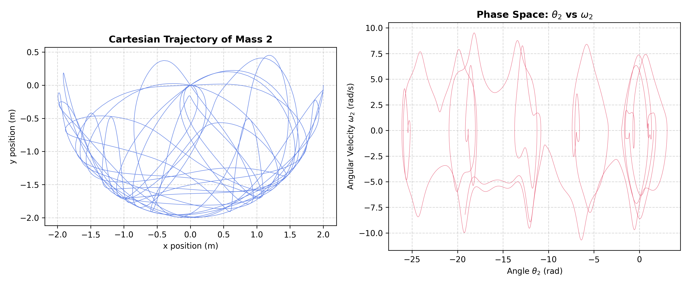
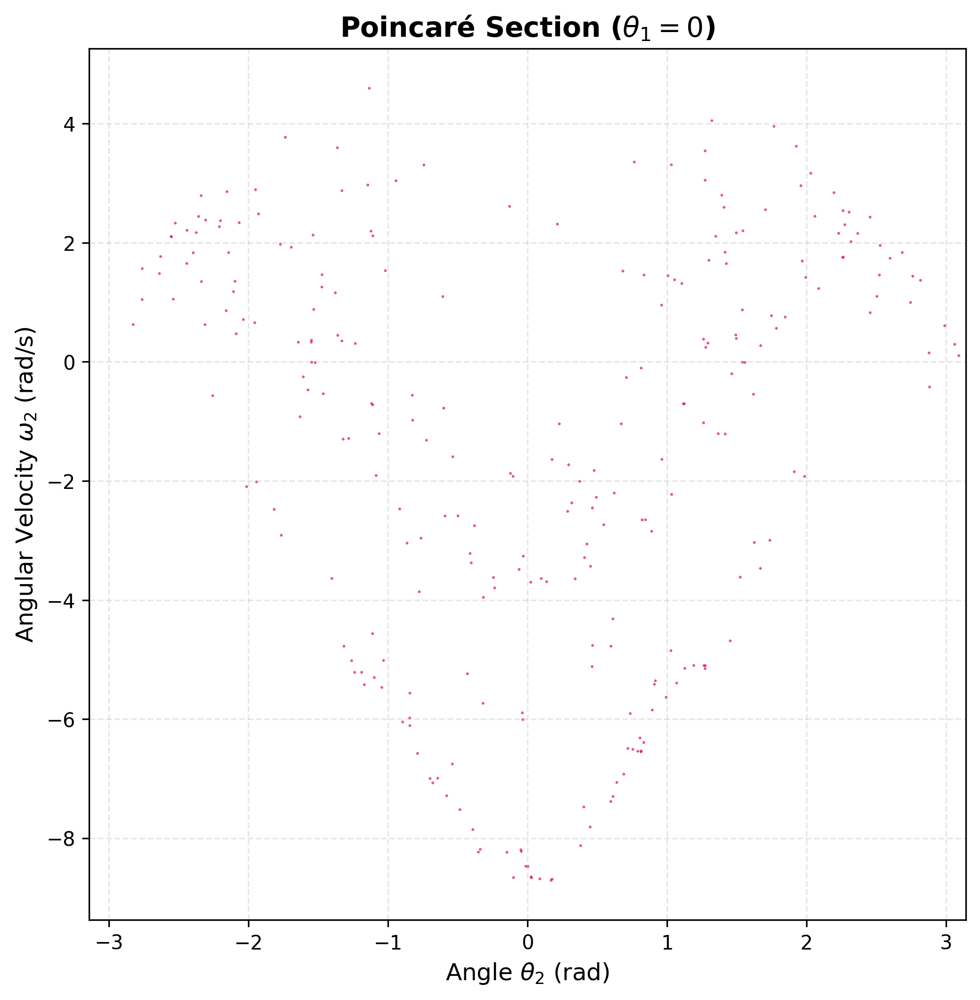
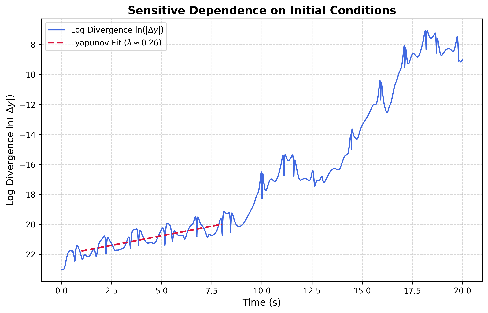

# Double Pendulum Simulation: Lagrangian Dynamics


This project is a high-precision numerical laboratory for exploring chaotic systems. It marks the transition from Newtonian vector mechanics to a vectorized Lagrangian framework, specifically designed to handle the non-linear coupling of a double pendulum with research-grade accuracy.

## Validated Milestones
*   **Vectorized Lagrangian Engine**: Implemented the Euler-Lagrange equations using the matrix form $M(\Theta) \ddot{\Theta} = f(\Theta, \dot{\Theta})$.
*   **High-Order Integration**: Utilizes the `DOP853` (8th-order adaptive Runge-Kutta) integrator for superior stability in chaotic regimes.
*   **Energy Conservation Firewall**: Verified that the Total Hamiltonian is conserved with a relative drift of $\sim 3.29 \times 10^{-13}$, significantly exceeding standard precision requirements.
*   **Automated Validation**: Integrated a GitHub Actions pipeline (`physics_tests.yml`) to ensure every code change respects the laws of thermodynamics.

## Phase Space & Chaotic Visualizations

The numerical engine's precision allows for the mapping of both continuous chaotic trajectories and discrete topological bounds.

### Real-Time Dynamics
A 60fps rendering of the double pendulum's chaotic motion, generated using `matplotlib.animation` to visually confirm the physical behavior before mathematical extraction.


### Cartesian Kinematics
The classic "spaghetti plot" demonstrating the extreme sensitivity and non-repeating bounded motion of the lower mass over time.


### Poincaré Section ($\theta_1 = 0$)
Sampling the phase space strictly when the primary arm crosses the vertical axis reveals the hidden "U-shape" geometric attractors bounding the chaos.


## Quantifying Chaos (Lyapunov Exponent)

To move beyond qualitative visuals, the engine measures the "Butterfly Effect" directly. By running two simultaneous simulations—one baseline and one with a microscopic $\theta_1$ perturbation of $10^{-10}$ radians—we track the exponential divergence of the parallel universes. 

The strictly positive slope extracted during the linear growth phase confirms the system is mathematically chaotic.


## Repository Structure
*   `src/`: Contains the core physics logic in `mechanics.py` and solver wrappers in `solvers.py`.
*   `scripts/`: High-performance execution scripts for animations, scatter plots, and divergence mapping.
*   `tests/`: The `test_mechanics.py` suite used for Hamiltonian and stability verification.
*   `docs/`: Formal theoretical derivations and the `lab_journal.md` recording project milestones.
*   `.github/workflows/`: CI/CD pipeline configuration for automated physics testing.

## Getting Started
### 1. Installation
```powershell
pip install -r requirements.txt
```
### 2. Run Physics Validation
To confirm the engine is operating at peak precision:
```powershell
python -m pytest -v -s tests/test_mechanics.py
```
## Research Benchmarks

The numerical engine was evaluated using a high-energy chaotic configuration ($\theta_1, \theta_2 = 90^\circ$ at $t=0$) to stress-test the limits of the Hamiltonian conservation.

| Metric | Scientific Target | Achieved Result | Status |
| :--- | :--- | :--- | :--- |
| **Numerical Energy Drift** | Relative error < $10^{-10}$ | **$3.29 \times 10^{-13}$** | **PASS** |
| **Hamiltonian Accuracy** | Analytical Baseline $\pm 10^{-8}$ | **Matches Theory** | **PASS** |
| **Integrator Precision** | Adaptive Step Control | **DOP853 (8th Order)** | **PASS** |
| **Maximum Lyapunov Exp** | $\lambda > 0$ (Chaotic) | $\lambda \approx 0.26$ | **PASS** |

---

## Completed Technical Milestones

*   **Vectorized Physics Engine**: Successfully implemented the Euler-Lagrange equations in matrix form, solving for angular accelerations via the relation $\mathbf{M}(\Theta) \ddot{\Theta} = \mathbf{f}(\Theta, \dot{\Theta})$ for optimized $O(n)$ computation.
*   **High-Precision Integration Suite**: Configured the `DOP853` solver within the `scipy.integrate` framework, utilizing absolute tolerances of $10^{-14}$ and relative tolerances of $10^{-12}$ to preserve system symmetry.
*   **Automated Validation Framework**: Developed a comprehensive `pytest` suite in `test_mechanics.py` that verifies the Total Hamiltonian against analytical potential energy formulas.
*   **CI/CD Physics Pipeline**: Established a GitHub Actions workflow (`physics_tests.yml`) that triggers automated precision checks on every push to ensure long-term numerical integrity.
*   **Theoretical Documentation**: Formalized the full Lagrangian derivation for the double pendulum and initialized a `lab_journal.md` for tracking numerical drift observations and project milestones.
* **Dynamic Visualizations**: Built real-time rendering of Cartesian trajectories using matplotlib.animation for direct visual confirmation of chaotic physical behavior.
* **Phase Space Analysis**: Engineered Poincaré sections using SciPy event tracking to map discrete topological bounds and visually verify strict energy conservation over extended time horizons.
* **Chaos Quantification**: Computed the Maximum Lyapunov Exponent by evaluating the continuous Euclidean divergence of micro-perturbed state vectors in 4D phase space.
